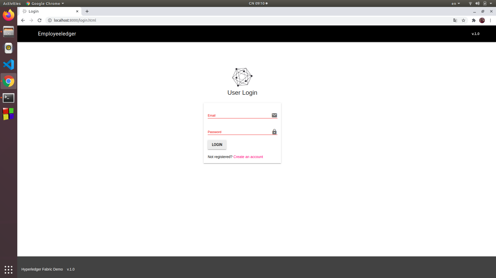
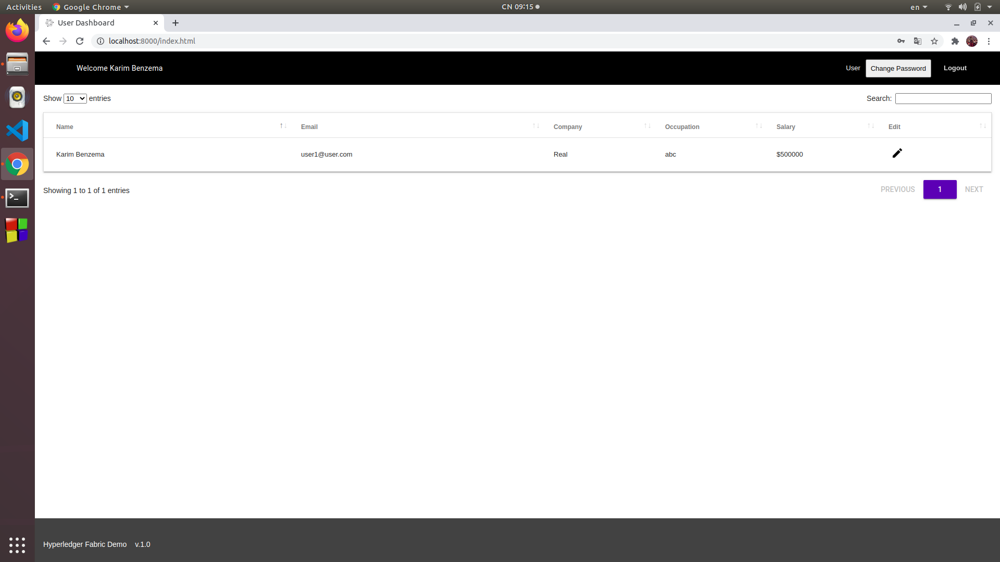
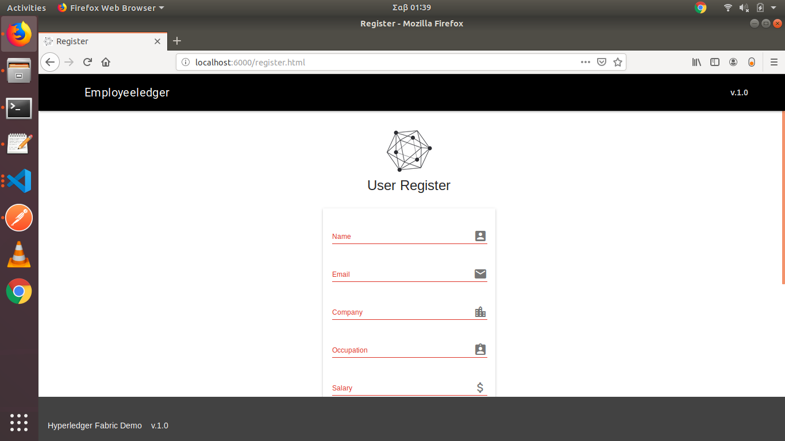
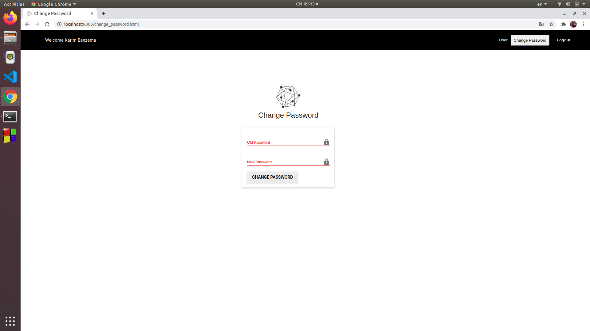

<h1>Employeeledger</h1>

Employeeledger là một web application được xây dựng bằng Go SDK để triển khai một hệ thống mạng Hyper Ledger Fabric. Web app cung cấp một nền tảng các bản ghi người dùng, và một số các chức năng như thêm, sửa xóa người dùng với hai phân quyền chính là người sử dụng (user) và quản trị viên (admin)

<h4>Installation</h4>

Các ứng dụng yêu cầu: <a href="https://www.docker.com/">Docker</a> &amp; <a href="https://golang.org/">Go</a>.

<h3>Docker</h3>
<pre><code class="language-sh">$ sudo apt install docker.io
$ sudo apt install docker-compose
</code></pre>
<h2>Go</h2>
<h4>Installation</h4>
<pre><code class="language-sh">$ sudo apt-get update
$ sudo apt-get install golang-go
</code></pre>
<h4>Cài đặt biến môi trường cho Go</h4>
<h6>Thêm các biến môi trường:</h6>
<pre><code class="language-sh">$ export GOPATH=$HOME/go
$ export PATH=$PATH:/usr/local/go/bin:$GOPATH/bin
</code></pre>
<h6>sau đó</h6>
<pre><code class="language-sh">$ source ~/.profile
$ go version
$ go version go1.11 linux/amd64
</code></pre>

<h3>Các bước chạy mạng:</h3>

Mạng Hyperledger Fabric được xây dựng với 1 org và 2 peer

<h4>Chạy ứng dụng</h4>
<ul>
<li>Trước hết cần chuyển thư mục Employeeledger vào đường dẫn <code>home/go/src/github.com</code></li>
<li>Trong thư mục Employeeledger đã có một file "make",mở terminal và gõ "make" và đợi trong giây lát để ứng dụng được build</li>
<li>Khi có thông báo thành công, ứng dụng đã được chạy trên cổng 8000 của localhost</li>
<li>Bây giờ, mở trình duyệt lên và gõ <a href="http://localhost:8000">http://localhost:8000</a></li>
</ul>

<h4>Một số ảnh chụp màn hình</h4>

<h5>Đăng nhập</h5>

<h5>Bảng điều khiển</h5>

<h5>Đăng kí</h5>

<h5>Đổi mật khẩu</h5>

<h5>Cập nhật thông cá nhân</h5>

<h2>Video hướng dẫn sử dụng</h2>

<video width="800" height="450" src="https://www.youtube.com/embed/V2hlQkVJZhE" frameborder="0" allow="accelerometer; autoplay; encrypted-media; gyroscope; picture-in-picture" allowfullscreen></video>

